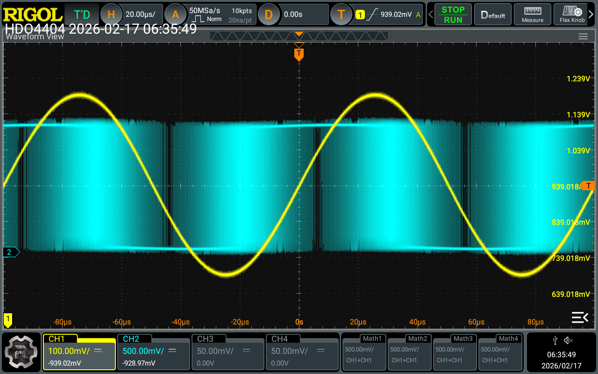
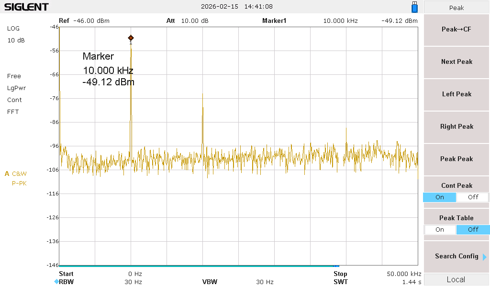
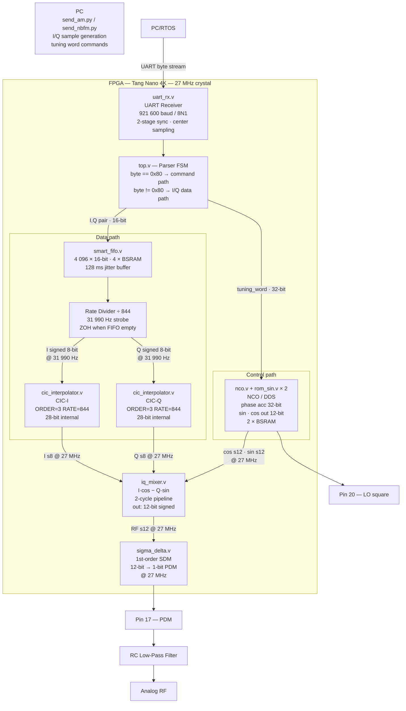
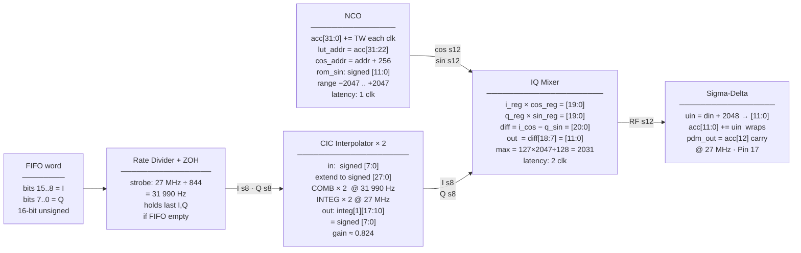
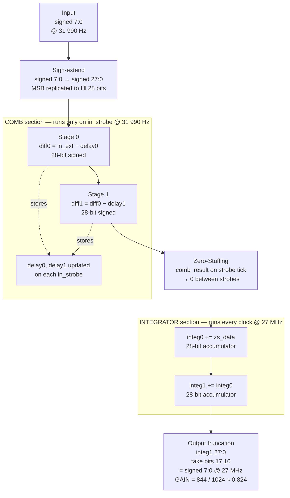
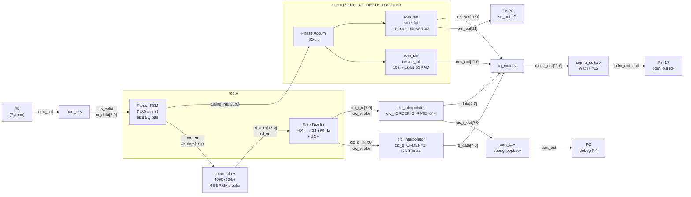
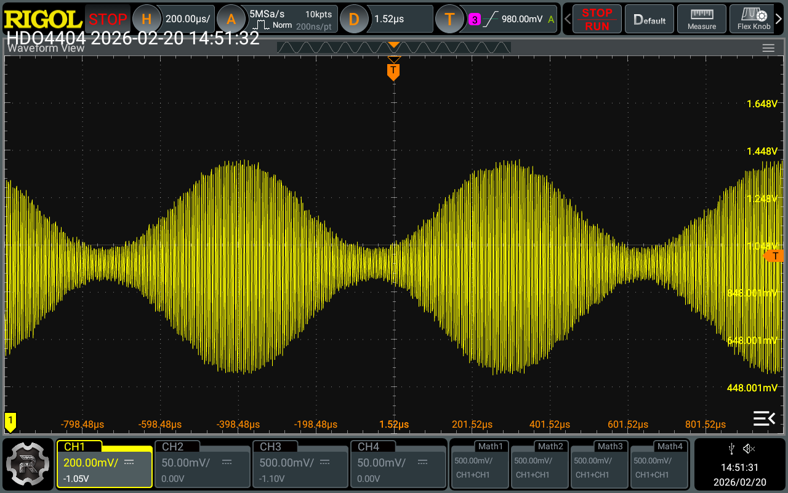
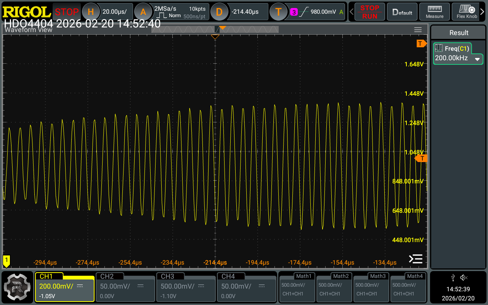
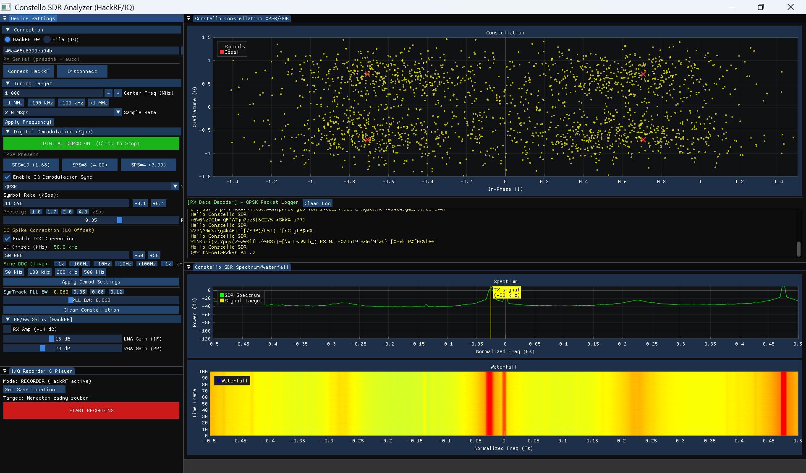
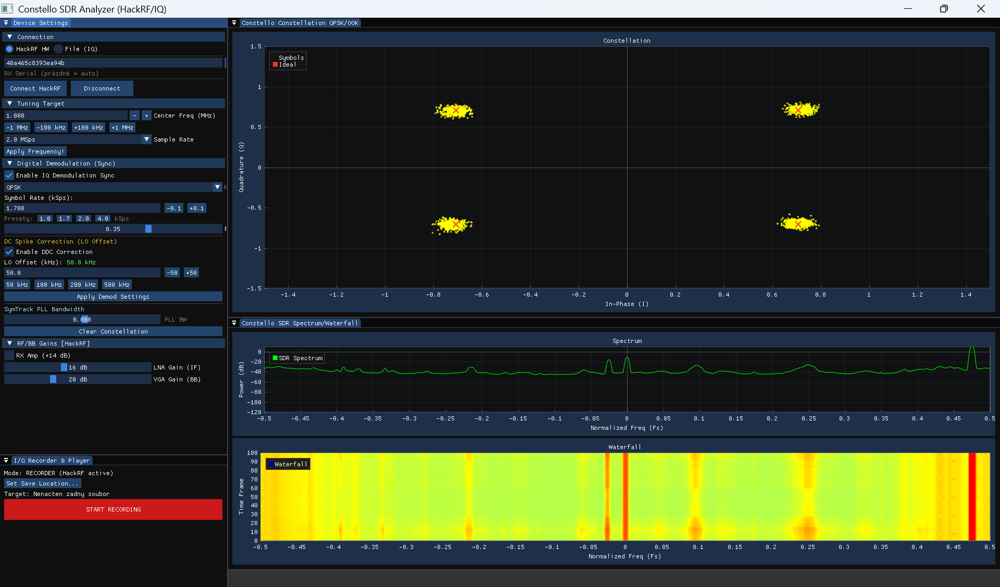

# NanoSDR-TX

**NanoSDR-TX** is an FPGA-based Software Defined Radio (SDR) transmitter for the **Tang Nano 4K** (Gowin GW1NSR-LV4C). It implements a fully digital **general-purpose I/Q modulator** capable of AM, FM, CW, and other modulations generated by PC software.

> **IMPORTANT WARNING**
>
> This module is designed for **laboratory experiments and educational purposes only**.
> It is NOT intended for direct on-air transmission.
>
> * The GPIO output is a digital PDM bitstream rich in harmonics.
> * You **MUST** use a suitable low-pass filter (LPF). At least an simple RC LP.
> * Ensure correct **50-ohm impedance matching** before connecting to any RF equipment (e.g. buffer with MCP6022).
> * Connecting the output directly to an antenna may cause illegal interference.


<p align="center">
  <br>
  <b>PDM waveform of 1-bit output and signal behind LPF</b>
</p>


<p align="center">
  <br>
  <b>Spectrum of unfiltered carrier 10kHz in PDM output</b>
</p>

---

## Hardware & Requirements

| Item | Value |
|------|-------|
| Board | Tang Nano 4K (Gowin GW1NSR-LV4CQN48PC7/I6) |
| System clock | 27 MHz (on-board crystal) |
| UART | 921 600 baud, 8N1 |
| RF output | Pin 17 (PDM — connect via RC low-pass filter) |
| LO square output | Pin 20 (MSB of NCO sine = carrier square wave) |
| UART RX | Pin 13 (PC TX → FPGA) |
| UART TX | Pin 16 (FPGA loopback → PC, debug only) |
| UART RTS | Pin 18 (Hardware flow control from FPGA to PC FTDI CTS) |
| BSRAM used | 6 / 10 blocks |

---

## Signal Chain Overview

### Part 1 — Full System (PC → FPGA → RF)



---

### Part 2 — DSP Pipeline: Bit Widths at Each Stage



---

## Detailed Signal Flow with Bit Widths

### 1. RTOS (PC) → UART (`uart_rx.v`)

| Parameter | Value |
|-----------|-------|
| Baud rate | 921 600 |
| Clock | 27 000 000 Hz |
| Clocks per bit | 29 (27 000 000 / 921 600 ≈ 29.3) |
| Output | `rx_data [7:0]`, pulse `rx_valid` |
| Synchronizer  |
| Sampling | Center-sampled (HALF_BIT = 14 clocks into bit) |

The receiver detects start bit, samples each data bit at the midpoint, validates stop bit, then pulses `rx_valid` for one clock.

---

### 2. Command Parser (`top.v` inline FSM)

Separates the byte stream into two paths based on byte value:

```
Received byte == 0x80  →  Command path: collect next 4 bytes as tuning word [31:0]
Received byte != 0x80  →  Data path: store as I byte, wait for Q byte, push {I,Q} to FIFO
```

**UART Protocol:**

```
I/Q data pair:    [I_byte 8-bit] [Q_byte 8-bit]
                  signed -127..+127 (0x81..0x7F via 0x00)
                  0x80 = -128 FORBIDDEN — reserved as command prefix

Tuning word cmd:  [0x80] [TW[31:24]] [TW[23:16]] [TW[15:8]] [TW[7:0]]
                  5 bytes total, MSB first
```

**Tuning word → carrier frequency:**
```
TW = round(freq_hz × 2^32 / 27_000_000)
freq_hz = TW × 27_000_000 / 2^32

Example: 150 kHz → TW = 23 860 929 (0x016C0000)
Default at reset:  TW = 1 590 720  → ~10 kHz
```

FIFO write: `{i_byte[7:0], q_byte[7:0]}` → 16-bit word.
Write guard: `fifo_wr_en & ~fifo_full` — silently drops if FIFO full.

---

### 3. Smart FIFO (`smart_fifo.v`)

| Parameter | Value |
|-----------|-------|
| DATA_WIDTH | 16 bits (I[15:8] + Q[7:0]) |
| ADDR_WIDTH | 12 → depth = 2^12 = **4 096 entries** |
| Memory | 4 096 × 16 = 65 536 bit → **4 BSRAM blocks** |
| Buffer duration | 4 096 / 31 990 Hz = **128 ms** |
| Interface | Synchronous, FWFT (First-Word-Fall-Through) |
| Overflow | Silent drop (`wr_en & ~full` guard in top.v) |
| Underflow | ZOH ( Zero Order Hold) — last I/Q held, `empty` signal asserted |

**FWFT behaviour:** data appears on `rd_data` automatically as soon as it is written; no extra read-enable pulse needed before the first word.

**BSRAM inference:** the `mem[0:DEPTH-1]` array with synchronous write and unconditional synchronous read is the pattern Gowin Yosys maps to BSRAM primitives.

---

### 4. Rate Divider + ZOH (`top.v`)

```
rate_div counts 0..843 (CIC_RATE-1=843), resets at 844
rate_tick = (rate_div == 0)  →  pulses at 27 000 000 / 844 = 31 990.52 Hz

On rate_tick:
  cic_strobe = 1  (always — drives CIC at baseband rate)
  if FIFO not empty:
      read FIFO → cic_i_in = fifo_data[15:8]  (signed [7:0])
                   cic_q_in = fifo_data[7:0]   (signed [7:0])
  else:
      hold previous cic_i_in / cic_q_in  ← ZOH
```

ZOH is the underflow safety net: CIC continues running, mixer and sigma-delta see a frozen I/Q value, so the carrier stays on at the last amplitude/phase — modulation simply pauses.

---

### 5. CIC Interpolator — dual instance (`cic_interpolator.v`)

Two identical instances: `cic_i` (I channel) and `cic_q` (Q channel).

| Parameter | Value |
|-----------|-------|
| WIDTH_IN | 8 bits (signed) |
| WIDTH_OUT | 8 bits (signed) |
| ORDER | 2 |
| RATE | 844 |
| WIDTH_INT | `WIDTH_IN + ORDER × ⌈log2(RATE)⌉` = 8 + 2×10 = **28 bits** |
| GAIN_SHIFT | `(ORDER−1) × ⌈log2(RATE)⌉` = 1×10 = **10** |

**Internal structure:**



**Gain:** CIC effective gain = RATE / 2^GAIN_SHIFT = 844 / 1024 ≈ **0.824**

Input ±127 → CIC output ≈ ±104 (at 27 MHz output rate).

---

### 6. NCO — Numerically Controlled Oscillator (`nco.v` + `rom_sin.v`)

| Signal | Width | Description |
|--------|-------|-------------|
| `tuning_word` | 32-bit | Phase increment per clock |
| `phase_accumulator` | 32-bit | Wraps at 2^32, incremented every clock |
| `lut_addr_sin` | 10-bit | `phase_acc[31:22]` — top 10 bits |
| `lut_addr_cos` | 10-bit | `lut_addr_sin + 256` — 90° offset (256/1024 = ¼ period) |
| `sin_out` | signed 12-bit | -2047 .. +2047 |
| `cos_out` | signed 12-bit | -2047 .. +2047 |

**Sine ROM (`rom_sin.v`):** 1024-entry case statement, 12-bit signed values, 1-clock latency (registered output). Each ROM instance uses **1 BSRAM block** (1024×12 = 12 288 bit). Two instances = 2 BSRAM blocks total.

**Frequency resolution:** 27 000 000 / 2^32 ≈ **0.006 Hz per TW LSB**

**Square wave output:** `sq_out = sin_out[11]` — MSB of sine = 1-bit square wave at carrier frequency, available on Pin 20 as an unmodulated LO reference.

---

### 7. I/Q Mixer (`iq_mixer.v`)

Implements: **RF = I·cos(ωt) − Q·sin(ωt)**

```
Inputs (registered — 1 clock latency):
  i_reg  [7:0]   signed  ← from CIC I output
  q_reg  [7:0]   signed  ← from CIC Q output
  cos_reg [11:0] signed  ← from NCO cos_out
  sin_reg [11:0] signed  ← from NCO sin_out

Multiply (inferred DSP blocks):
  i_cos [19:0] signed = i_reg × cos_reg   (8 × 12 = 20-bit product)
  q_sin [19:0] signed = q_reg × sin_reg

Subtract:
  diff [20:0] signed = i_cos − q_sin      (21-bit, carry bit)

Output (registered — +1 clock latency):
  out_data [11:0] signed = diff[18:7]     (÷128 = shift right 7)
```

Using bit 18 instead of 19 effectively halves the divisor (128 instead of 256), **doubling the output amplitude** (Vpp 1.34 V → 2.68 V after RC filter).


**Total mixer pipeline latency: 2 clocks** (input register + output register).

---

### 8. Sigma-Delta DAC (`sigma_delta.v`)

| Signal | Width | Description |
|--------|-------|-------------|
| `din` | signed 12-bit | RF signal from mixer (-2048..+2047) |
| `din_unsigned` | 12-bit | `din + 2048` — offset binary (0..4095) |
| `accumulator` | 13-bit | Error accumulator (1 bit wider for carry) |
| `pdm_out` | 1-bit | PDM output at 27 MHz |

**Each clock:**
```
accumulator[11:0] += din_unsigned   (lower 12 bits — wraps on overflow)
pdm_out = accumulator[12]           (carry = 1-bit quantizer output)
```

The carry bit is the sigma-delta output: its average density equals the input value as a fraction of full scale. Quantization noise is spectrally shaped toward high frequencies (noise shaping ∝ f for 1st order).

**Output amplitude** (3.3 V supply, LP e.g. 1 kΩ + 1 nF RC filter at fc ≈ 160 kHz):
```
din =     0  →  PDM density 50%  →  DC = 1.65 V  (midpoint)
din = +2031  →  PDM density 90%  →  V ≈ 2.99 V
din = −2031  →  PDM density 10%  →  V ≈ 0.31 V
Peak-to-peak swing ≈ 2.68 V
```

---

## Complete Signal Width Table

| Stage | Signal | Width | Domain | Notes |
|-------|--------|-------|--------|-------|
| PC | I byte, Q byte | 8-bit signed | — | range −127..+127; 0x80 forbidden |
| UART RX | `rx_data` | 8-bit | 27 MHz | pulse `rx_valid` |
| Parser | `fifo_wr_data` | 16-bit | 27 MHz | `{I[7:0], Q[7:0]}` |
| FIFO | storage | 16-bit × 4096 | 27 MHz | 4 BSRAM blocks, 128 ms buffer |
| FIFO → CIC | `cic_i_in`, `cic_q_in` | 8-bit signed | 31 990 Hz | from FIFO or ZOH |
| CIC internal | `integ[0]`, `integ[1]` | 28-bit signed | 27 MHz | accumulators |
| CIC output | `cic_i_out`, `cic_q_out` | 8-bit signed | 27 MHz | bits [17:10] of integ[1] |
| NCO accumulator | `phase_accumulator` | 32-bit | 27 MHz | wraps on overflow |
| NCO LUT address | `lut_addr_sin/cos` | 10-bit | 27 MHz | top 10 bits of accumulator |
| NCO output | `sin_out`, `cos_out` | 12-bit signed | 27 MHz | range −2047..+2047 |
| Mixer intermediate | `i_cos`, `q_sin` | 20-bit signed | 27 MHz | 8×12 product |
| Mixer diff | `diff` | 21-bit signed | 27 MHz | i_cos − q_sin |
| Mixer output | `mixer_out` | 12-bit signed | 27 MHz | diff[18:7] |
| Sigma-delta accum | `accumulator` | 13-bit | 27 MHz | lower 12 += din_unsigned |
| RF output | `pdm_out` | 1-bit | 27 MHz | Pin 17 |
| LO output | `sq_out` | 1-bit | 27 MHz | Pin 20, = sin_out[11] |

---

## Module Interconnection Map



---

## BSRAM Resource Usage

```
BSRAM #1-4  smart_fifo    4096 × 16-bit = 65 536 bit  (4 blocks)
BSRAM #5    rom_sin       1024 × 12-bit = 12 288 bit  (1 block, sine)
BSRAM #6    rom_sin       1024 × 12-bit = 12 288 bit  (1 block, cosine)
─────────────────────────────────────────────────────
Total used:  6 / 10 blocks  (60 %)
Remaining:   4 blocks free
```

Note: NCO instantiates `rom_sin` twice with different addresses. Gowin synthesizer maps each instance to a separate BSRAM because one block cannot serve two independent read addresses simultaneously.

---

## Flow Control

The FPGA runs autonomously from its 27 MHz crystal — it consumes samples from the FIFO at exactly **31 990.52 Hz** regardless of what Python does. Python must pace its send rate to match.

```
Python target send rate  =  --rate / factor  =  32 000 / 0.97  =  32 990 S/s
FPGA consume rate        =  27 000 000 / 844 =  31 991 S/s
Overflow (fill) rate     =  32 990 − 31 991  =    999 S/s
Time to fill 4096 FIFO   =  4096 / 999       =    4.1 seconds
```

After ~4 seconds the FIFO is full. In steady state ~3% of samples overflow (silently dropped). The 128 ms FIFO buffer absorbs Windows OS scheduler jitter up to 128 ms.

**Python scripts use:**
- `timeBeginPeriod(1)` — sets Windows timer to 1 ms resolution
- Drift-corrected `time.monotonic()` pacing — compensates for OS jitter by catching up across chunks

**Known limitation of pure software pacing:** OS spikes longer than 128 ms (USB events, etc.) drain the FIFO → ZOH events.

**Hardware Flow Control (Recommended):** The scripts `send_nbfm_hw.py` and `send_am_hw.py` utilize RTS/CTS hardware flow control. 
This eliminates ZOH events completely. It requires connecting **Pin 18 (FPGA RTS)** to the **CTS** input of your FTDI adapter. In the terminal, `.` indicates transmission and `!` indicates that the FPGA buffer is full and PC is halted.

---

## Python Scripts

| Script | Modulation | Key options |
|--------|-----------|-------------|
| `send_nbfm.py` | NBFM, CW | `--freq`, `--tone`, `--wav`, `--cw`, `--deviation`, `--rate`, `--loop` |
| `send_am.py` | AM | `--freq`, `--tone`, `--wav`, `--mod`, `--amp` (auto), `--rate`, `--loop` |
| `send_nbfm_hw.py` | NBFM, CW | Same as above, but uses hardware flow control via RTS/CTS |
| `send_am_hw.py` | AM | Same as above, but uses hardware flow control via RTS/CTS |


**I/Q encoding:**
```
send_nbfm.py (FM):  I = 127·cos(φ),  Q = 127·sin(φ),  φ += 2π·deviation·audio/rate
send_am.py   (AM):  I = amp·(1 + m·audio),  Q = 0
send_nbfm.py (CW):  I = 127,  Q = 0  (constant)
```

Values clamped to −127..+127. Value −128 (0x80) is never sent — it is the UART command prefix.

---

## File Structure

| File | Role |
|------|------|
| `top.v` | Top-level: UART parser, FIFO control, rate divider, ZOH, module wiring |
| `uart_rx.v` | UART receiver, 2-stage synchronizer, center sampling |
| `uart_tx.v` | UART transmitter (debug loopback of CIC I output) |
| `smart_fifo.v` | Synchronous FWFT FIFO, BSRAM inference, 4096×16 entries |
| `cic_interpolator.v` | CIC filter ORDER=3 RATE=844, Comb+Integrator, 28-bit internal |
| `nco.v` | Phase accumulator 32-bit + dual ROM addressing |
| `rom_sin.v` | 1024-entry 12-bit sine LUT (BSRAM-inferred) |
| `iq_mixer.v` | Quadrature mixer: (I·cos − Q·sin)>>7, 2-cycle pipeline |
| `sigma_delta.v` | 2nd-order sigma-delta DAC, 12-bit in, 1-bit PDM out |
| `send_nbfm.py` | Python: NBFM/CW transmitter + UART streaming |
| `send_am.py` | Python: AM transmitter + UART streaming |


---

## Frequency Limits

| Range | Quality | Notes |
|-------|---------|-------|
| 50–200 kHz | Excellent | OSR 67–270, RC filter < 3 dB loss |
| 200 kHz–1 MHz | Good | RC filter 3–16 dB loss, usable |
| 1–7 MHz | Marginal | Sigma-delta noise increasing |
| > 7 MHz | Poor | Noise dominant, RC filter insufficient |
| > 13.5 MHz | Unusable | Nyquist limit of 27 MHz clock |

RC filter recommendation: **1 kΩ + 1 nF** (fc ≈ 160 kHz) for tests up to 200 kHz.
For higher frequencies, reduce C: 330 pF (fc ≈ 480 kHz), 100 pF (fc ≈ 1.6 MHz).

---

## Quick Start

```bash
# 1. Synthesize and flash (Lushay Code Visual Code or gowin toolchain)

# 2. CW carrier at 100 kHz (oscilloscope verification)
python send_nbfm_hw.py --port COM4 --freq 100000 --cw --loop

# 3. AM modulation — 1 kHz tone at 150 kHz carrier
python send_am_hw.py --port COM4 --freq 150000 --tone 1000 --mod 0.5 --rate 32000 --loop

# 4. NBFM — wideband test (visible on oscilloscope)
python send_nbfm_hw.py --port COM4 --freq 50000 --tone 100 --deviation 20000 --rate 32000 --loop

# 5. QPSK Transmitter script with message "Hello Constello SDR! LF" and sync 0x1A2B3C4D
python .\send_qpsk_hw.py --port COM4 --sps 4 --loop --symbols 5000

```

<p align="center">
  <br>
  <b>AM modulation -> send_am.py </b>
</p>

<p align="center">
  <br>
  <b>Detail of the carrier wave</b>
</p>

<p align="center">
  <br>
  <b>Decoding messages from QPSK burdened by filter imperfection, 1-bit converter & RC as LP, but it works</b>
</p>

<p align="center">
  <br>
  <b>For comparison: Decoding messages from a QPSK transmitter with a DA converter and a high-quality LP filter.</b>
</p>

